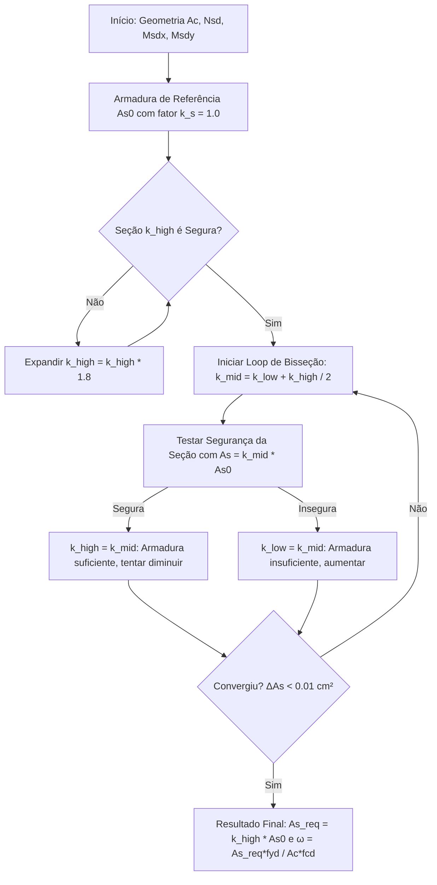

# Algoritmo de Dimensionamento de Área de Aço por Bisseção em Flexão Composta Oblíqua (MSOLVER / FCO)

Este documento descreve a fundamentação teórica, a formulação matemática e o algoritmo numérico implementado no motor de cálculo para realizar o **dimensionamento da área de aço necessária ($A_{s,req}$)** em seções transversais de concreto armado sujeitas à **Flexão Composta Oblíqua com Força Normal ($N_{sd}, M_{sdx}, M_{sdy}$)**.

---

## 1. Contexto: Verificação vs. Dimensionamento

- **Verificação (Análise Direta)**: Dada uma seção com geometria e arranjo de armadura fixos $A_s$, calcula-se a envoltória de momentos resistentes $M_{rd}(N_{sd})$ e checa-se se a solicitação aplicada $M_{sd} = (M_{sdx}, M_{sdy})$ está **no interior** da envoltória.
- **Dimensionamento (Análise Inversa)**: Dada a geometria do concreto e a disposição relativa das barras, busca-se a **área total de aço mínima $A_{s,req}$** para a qual a seção atinge o equilíbrio no estado limite último (ELU) exatamente para os esforços solicitantes solicitados ($N_{sd}, M_{sdx}, M_{sdy}$).

---

## 2. Formulário Matemático e Parâmetros Adimensionais

Para possibilitar a comparação direta com os **ábacos consagrados na literatura** (ex: Venturini, Martha, Montoya, Pinheiro), o algoritmo calcula as seguintes variáveis adimensionais reduzidas:

### 2.1. Esforço Normal Reduzido ($\nu$)
$$\nu = \frac{N_{sd}}{A_c \cdot f_{cd}}$$

Onde:
- $N_{sd}$: Força normal solicitante de projeto (kN).
- $A_c$: Área da seção transversal de concreto ($\text{cm}^2$).
- $f_{cd}$: Resistência de cálculo do concreto à compressão ($\text{kN/cm}^2 = f_{ck} / \gamma_c$).

### 2.2. Momentos Fletor Reduzidos ($\mu_x$ e $\mu_y$)
$$\mu_x = \frac{M_{sdx}}{A_c \cdot h_y \cdot f_{cd}}, \quad \mu_y = \frac{M_{sdy}}{A_c \cdot h_x \cdot f_{cd}}$$

Onde:
- $M_{sdx}, M_{sdy}$: Momentos fletores solicitantes de projeto em $x$ e $y$ ($\text{kN.cm}$).
- $h_x, h_y$: Dimensões totais da seção nas direções $x$ e $y$ ($\text{cm}$).

### 2.3. Taxa Mecânica de Armadura Reduzida ($\omega$)
$$\omega = \frac{A_{s,req} \cdot f_{yd}}{A_c \cdot f_{cd}}$$

Onde:
- $A_{s,req}$: Área total de aço calculada pelo algoritmo ($\text{cm}^2$).
- $f_{yd}$: Tensão de escoamento de cálculo do aço ($\text{kN/cm}^2 = f_{yk} / \gamma_s$).

---

## 3. Algoritmo Numérico de Busca (Bisseção)

O algoritmo utiliza o método iterativo da **Bisseção** variando um fator de escala de armadura $k_s \in [k_{low}, k_{high}]$:

$$A_s(k_s) = k_s \cdot A_{s0}, \quad \Phi(k_s) = \sqrt{k_s} \cdot \Phi_0$$

### Passo a Passo Numérico:
1. **Estabelecer Limite Inferior**: $k_{low} = 0.001$ (armadura quase nula).
2. **Estabelecer Limite Superior**: $k_{high} = 1.0$. Caso a armadura inicial não seja suficiente para resistir a $M_{sd}$, o algoritmo expande geometricamente $k_{high}$ ($k_{high} \leftarrow 1.8 \cdot k_{high}$) até encontrar uma seção segura.
3. **Refinamento por Bisseção**:
   - Calcula $k_{mid} = \frac{k_{low} + k_{high}}{2}$.
   - Ajusta os diâmetros das barras $\Phi = \sqrt{k_{mid}} \cdot \Phi_0$.
   - Calcula a envoltória $M_{rd}(N_{sd})$ e verifica se $(M_{sdx}, M_{sdy})$ está contido.
   - Se for seguro, $k_{high} \leftarrow k_{mid}$ (tenta reduzir para economizar aço).
   - Se for inseguro, $k_{low} \leftarrow k_{mid}$ (precisa de mais aço).
4. **Critério de Parada**: Interrompe quando a variação da área $(k_{high} - k_{low}) \cdot A_{s0} \le 0.01\text{ cm}^2$ ou atinge o máximo de iterações (30 iterações).

---

## 4. Comparação com Ábacos Consagrados

Para validar o solver contra os **ábacos tradicionais de Flexão Composta Oblíqua** (como os de Venturini ou Montoya):

1. Obtenha a taxa mecânica do ábaco para os parâmetros de entrada $(\nu, \mu_x, \mu_y)$:
   $$\omega_{abaco}$$
2. Execute o solver e extraia o valor calculado:
   $$\omega_{solver} = \frac{A_{s,req} \cdot f_{yd}}{A_c \cdot f_{cd}}$$
3. Calcule a diferença percentual:
   $$\text{Erro (\%)} = \frac{\omega_{solver} - \omega_{abaco}}{\omega_{abaco}} \times 100\%$$

---

## 5. Exemplo de Saída do Solver de Dimensionamento

| Parâmetro | Valor Calculado | Unidade |
| :--- | :--- | :--- |
| **Área de Concreto ($A_c$)** | 1000.00 | $\text{cm}^2$ (Seção $20 \times 50$) |
| **Normal Reduzida ($\nu$)** | -0.190 | adimensionado |
| **Momento Reduzido ($\mu_x$)** | 0.076 | adimensionado |
| **Momento Reduzido ($\mu_y$)** | 0.048 | adimensionado |
| **Área de Aço Solicitada ($A_{s,req}$)** | **5.42** | $\text{cm}^2$ |
| **Taxa Mecânica ($\omega$)** | **0.111** | adimensionado |
| **Taxa Percentual ($\rho$)** | **0.54%** | % da área de concreto |
| **Iterações Utilizadas** | 12 | iterações da Bisseção |
